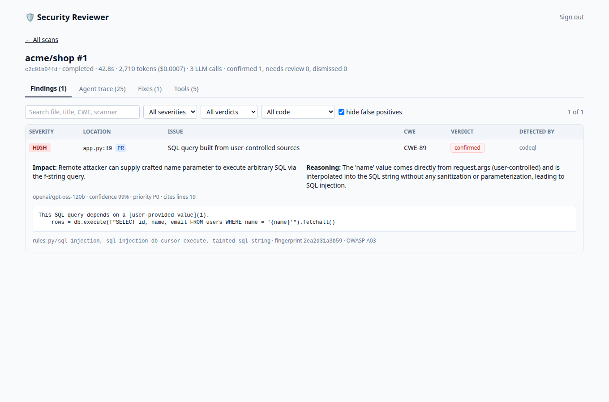
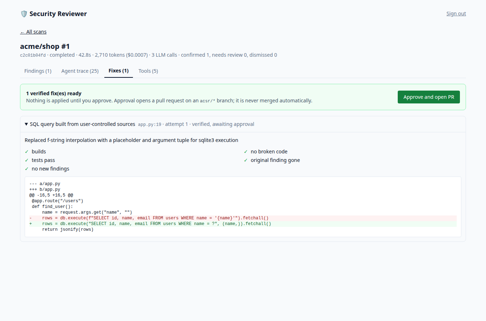

# Agentic Code Security Reviewer

An autonomous reviewer for GitHub pull requests. **Deterministic scanners produce the evidence, LLM agents
reason over it, and nothing is accepted until tools verify it.**

```
PR opened ─► FastAPI webhook ─► Redis ─► worker ─► LangGraph
                                                    plan ─► scan ─► correlate ─► analyze ─► discover ─► report
                                                                       │                                   │
                          Semgrep · CodeQL · Gitleaks · Trivy · Syft ◄─┘                 PR comment ◄──────┘
                          (all behind an MCP server, sandboxed)
                                                    └─► remediate ─► verify ─► retry ×3 ─► human approval ─► fix PR
```

* **Scanners** find candidates: Semgrep (patterns + custom rules), CodeQL (data flow), Gitleaks (secrets), Trivy (dependency CVEs, Dockerfile misconfiguration), Syft (SBOM).
* **Correlator** merges duplicates across scanners into one finding per issue.
* **Security Analyst** (LLM) reads the surrounding code and decides true or false positive. It must cite line numbers from the code it was shown.
* **Discovery** (LLM) looks for logic flaws scanners cannot see: missing ownership checks, unauthenticated admin routes, weak token randomness.
* **Remediation** proposes a minimal patch. **Verification** rebuilds, runs the project's tests and rescans in a network-less sandbox. A patch that fails is retried with the failure fed back, at most 3 times.
* **Nothing is merged and no PR is opened without a human.** Approval opens a PR on an `acsr/*` branch.

## Results at a glance

Held-out split (12 cases never used for tuning, 2 independent runs, `gpt-oss-20b`). Full tables, caveats and the disclosed ground-truth revisions are in [docs/results.md](docs/results.md) and [docs/benchmark.md](docs/benchmark.md).

| | Precision | Recall | F1 | Safe apps wrongly flagged |
|---|---|---|---|---|
| LLM-only | 0.81 | 0.81 | 0.81 (0.75–0.88) | 0% |
| Scanner-only | 0.75 | 0.75 | 0.75 | 25% |
| **Agentic (scanners + analyst)** | **1.00** | 0.75 | **0.86** | **0%** |
| Agentic + LLM discovery | 0.94 | 0.94 | 0.94 | 0% |

67% of confirmed held-out findings got an automatically **verified** fix (build + tests + rescan), and a hidden exploit test confirmed 3 of the 4 fixes it could check. About 20 s and $0.0001 per review. Small synthetic corpus: read it as a comparison between systems, not as production accuracy.




Measured results are in [docs/results.md](docs/results.md). Design: [docs/architecture.md](docs/architecture.md). Threat model: [docs/security-model.md](docs/security-model.md).

## Quickstart

Requirements: Docker, Python 3.12+ with [uv](https://docs.astral.sh/uv/), Node 20 (dashboard dev only).

```bash
cp .env.example .env        # add GROQ_API_KEY (or another OpenAI-compatible key), GITHUB_TOKEN, webhook secret, ADMIN_API_TOKEN
uv sync
make init                   # scanner images, offline vulnerability DB, test-runner image, CodeQL bundle (~1 GB, once)
make up                     # postgres, redis, api, worker, dashboard    →  API :8000, dashboard :8088
make test                   # unit + integration + security tests
```

### Try it without GitHub

```bash
GIT_BASE_URL=file://$PWD/.demo GITHUB_OFFLINE=true ENABLE_REMEDIATION=true make up
make demo                   # builds a local "PR", sends a signed webhook, prints the report
```

Open http://127.0.0.1:8088 and sign in with `ADMIN_API_TOKEN`: findings with evidence and verdicts, the
full agent/tool trace, remediation attempts with their verification results, and the approval button.

### Use it on a real repository

1. Create a fine-grained token limited to the target repo: **Contents: read**, **Pull requests: read/write**.
2. Expose the API (`smee.io`, ngrok, or a public host) and add a webhook: payload `…/webhook/github`, content type `application/json`, secret = `GITHUB_WEBHOOK_SECRET`, event **Pull requests**.
3. Open a PR. The worker clones it, scans, and posts (or updates) one report comment.
4. Optional: `ENABLE_REMEDIATION=true` proposes verified fixes. `ALLOW_GITHUB_WRITE=true` plus a token with **Contents: write** lets an approval open the fix PR.

## Layout

| Path | What |
|---|---|
| `backend/api` | webhook (HMAC-verified), dashboard/approval API |
| `backend/graph` | LangGraph workflow and the remediation subgraph |
| `backend/services` | scanners, correlator, analyst, discovery, remediation, verification, LLM client, GitHub client, sandbox |
| `mcp_server/` | the MCP server: typed, audited, least-privilege tools |
| `scanners/semgrep/rules` | offline Semgrep rulesets and our custom rules |
| `benchmarks/` | 28-case corpus with ground truth, generator, results |
| `frontend/` | React + TypeScript + Tailwind dashboard |
| `infra/` | Dockerfiles, Prometheus/Grafana/Jaeger config, scripts |
| `tests/` | `unit/`, `integration/` (need Docker + Postgres), `security/` (sandbox isolation) |

## Configuration

Everything is an environment variable (see `.env.example`). The switches that matter:

| Variable | Default | Effect |
|---|---|---|
| `LLM_PROVIDER` / `LLM_MODEL` / `GROQ_API_KEY` | groq / `openai/gpt-oss-120b` | any OpenAI-compatible endpoint works via `GROQ_BASE_URL` |
| `LLM_TOKENS_PER_MINUTE` | 7000 | client-side limiter; set just under your provider's TPM |
| `SCAN_TOKEN_BUDGET` | 200000 | hard cap of LLM tokens per scan |
| `ENABLE_CODEQL` / `ENABLE_DISCOVERY` | true / true | slowest scanner / the LLM logic-flaw pass |
| `ENABLE_REMEDIATION` | false | propose and verify fixes (never applied without approval) |
| `ALLOW_GITHUB_WRITE` | false | permits branches/commits/PRs on approval |
| `ADMIN_API_TOKEN` | empty | empty disables the dashboard API entirely |

## Observability

`make observability` adds Prometheus (:9090), Grafana (:3001, dashboard provisioned) and Jaeger (:16686).
Metrics: scans, latency, per-scanner duration and failures, findings by severity/verdict, LLM tokens and cost,
remediation outcomes. Traces are exported over OTLP; secrets are redacted from span attributes.

## Honest limitations

* Python is the supported language for analysis, patching and verification. JavaScript/TypeScript gets Semgrep, CodeQL and Gitleaks findings but no automatic fixes.
* Fix verification needs the project's tests. Repositories without tests get findings but no verified fixes (by design).
* The test runner image ships common libraries; a project needing other packages cannot be verified offline.
* OWASP Dependency-Check is not integrated; Trivy covers dependency CVEs.
* The security knowledge base is a curated static table (no vector store).
* Benchmark numbers come from a 28-case synthetic corpus, not production code. See [docs/results.md](docs/results.md) for what that does and does not show.
